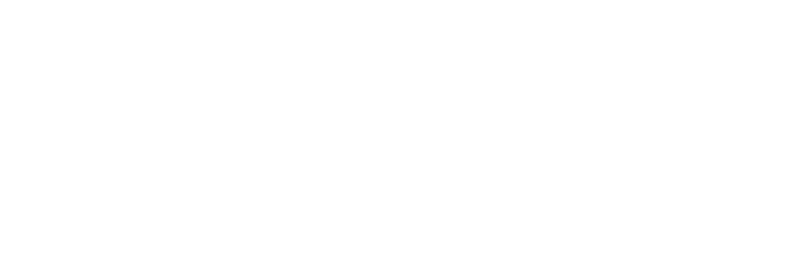

<div align="center">
  

  <h1>Scenic Native</h1>

  <p>
    <a href="https://github.com/sat-mtl/scenic-native/actions/workflows/build.yml"></a>
    
    <a href="https://sat-mtl.github.io/scenic-native/"></a>
    <br>
    <a href="https://ossia.io"></a>
    <a href="https://sat.qc.ca"></a>
  </p>
</div>

Scenic Native routes live audio, video and data between devices, software and
remote sites, from a single matrix: sources are rows, destinations are
columns, and a click connects them. It is a native reimplementation of
[Scenic](https://gitlab.com/sat-mtl/tools/scenic/scenic), the telepresence
application of the Société des Arts Technologiques, built on the
[ossia score](https://ossia.io) engine.

## Features

- 🎛️ One matrix for video, audio and data; video sources composited, audio mixed
- 📷 Cameras, screen and window capture, video and audio files, test signals
- 📡 NDI®, shmdata, Sh4lt, Spout and Syphon in and out
- 🌐 WebRTC telepresence, compatible with Scenic 5, aiguille and web browsers; STUN and TURN
- 🔴 Recording, RTMP and SRT streaming
- 🎹 MIDI, OSC and raw data over UDP, TCP, WebSocket and serial, with MIDI ⇄ OSC conversion
- 🎬 Scenes, sessions, and undo for every change
- 🇫🇷 English and French interface

## Download

Packages for Linux, macOS and Windows are on the
[releases page](https://github.com/sat-mtl/scenic-native/releases).

## Documentation

The [documentation](https://sat-mtl.github.io/scenic-native/), in English and
French, covers installation, usage, telepresence and development. Its sources
are in [`docs/`](docs/).

## Running from source

Scenic is written in QML and runs on an ossia score build that has the
`score-addon-ndi` and `score-addon-ltc` addons:

```sh
SCORE_BIN=/path/to/ossia-score ./run.sh
```

See [Development](docs/src/development.md) for the layout, the tests and how
to add a node type.

## License

GPL-3.0; see [LICENSE](LICENSE).

## Credits

Developed by the [Société des Arts Technologiques](https://sat.qc.ca), built
on [ossia score](https://ossia.io). NDI® is a registered trademark of Vizrt NDI AB.

<div align="center">
  <a href="https://sat.qc.ca">
    
  </a>
  <a href="https://ossia.io">
    
  </a>
</div>
